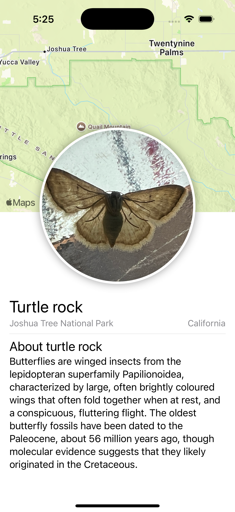

#  SwiftUI essentials
## Creating and combining views

https://developer.apple.com/tutorials/swiftui/creating-and-combining-views




### ShapeStyle
A color or pattern to use when rendering a shape.

https://developer.apple.com/documentation/swiftui/shapestyle

```swift
Text("environment have multiple values like isEditable, isSearching and etc.")
    .foregroundStyle(FirstDayStyle())

struct FirstDayStyle: ShapeStyle {
    func resolve(in environment: EnvironmentValues) -> Color {
        switch environment.colorScheme {
        case .dark:
            return Color.white
        case .light:
            return Color.black
        @unknown default:
            return Color.black
        }
    }
}
```


### Canvas WYSIWYG
Choose "Selectable" tab inside canvas
Commd + Ctrl + click UI element 

Ctrl + left click or right click on SwiftUI code to show additional configurations


